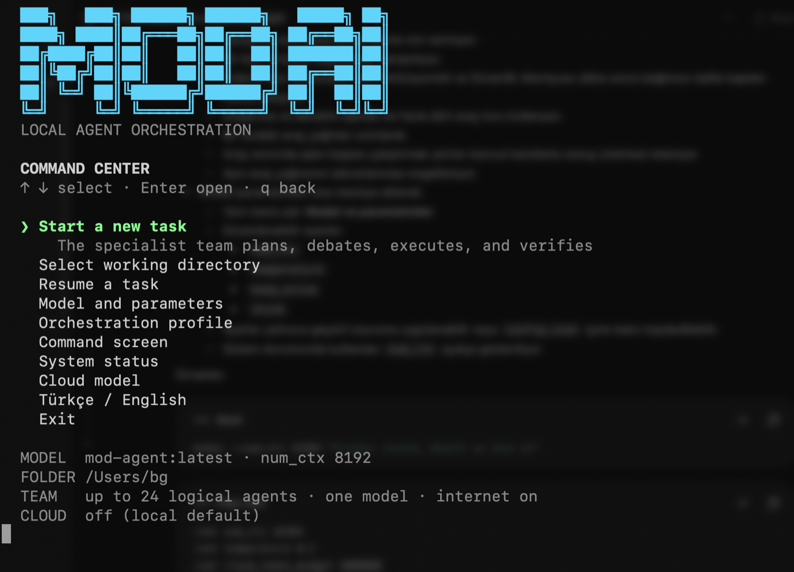

# MODAI

### One local model. A full specialist orchestra. Your files stay on your machine.

MODAI is a terminal-first, local-first multi-agent orchestrator for founders, small
teams, researchers, and software builders. A single Ollama model is reused as a
coordinated ensemble of specialists: the **Orchestra Conductor** writes the score,
specialists perform focused parts, the **Counterpoint Critic** challenges weak
assumptions, the **Lead Arranger** resolves conflicts, and independent quality gates
decide whether the work is actually finished.



<p align="center"><em>The MODAI Command Center: one model, one prompt, a coordinated specialist ensemble.</em></p>

```text
Your task
   ↓
Orchestra Conductor — plan and dependency score
   ↓
Specialist ensemble — research, product, code, operations, growth…
   ↓
Counterpoint Critic ↔ Lead Arranger — adversarial debate and repair
   ↓
Senior Sound Engineer + Test Percussionist + Security Tuner
   ↓
Evidence-backed result, checkpoint, and resumable run history
```

The default path is entirely local. Public research packages can optionally use an
OpenAI, Anthropic, or Google API model, but only after explicit per-task consent.
Potential secrets remain on the local route.

> Current development release: **3.5.1**. The repository README is published before
> the application source while local validation is in progress.

## Why MODAI

- **Local by default:** prompts, project files, intermediate outputs, and long-term
  run state remain on the computer unless hybrid routing is explicitly approved.
- **Unlimited local tokens:** Ollama inference has no MODAI token ceiling. A local
  run is never paused because its input/output count crossed a budget value.
- **Cloud cost guard:** only paid API tokens count against the configurable cloud
  budget. At the boundary, MODAI keeps the run alive and asks the user to add, for
  example, `250k`, `1m`, or `2m` tokens, or to explicitly pause.
- **One model, many disciplines:** a single loaded model avoids multiplying model
  memory on 16 GB machines while logical roles provide focused instructions and
  tools.
- **Real tools, real evidence:** agents inspect files, apply changes, run allowlisted
  commands, validate complete static applications, review diffs, and checkpoint results.
- **Quality gates:** software work is not marked complete while reviewer, tester, or
  security gates still report `VERDICT: FAIL`.
- **Long-running work:** every meaningful step is written to a run directory and can
  be resumed after interruption.
- **Keyboard-native TUI:** arrow-key menus, a cursor-aware prompt editor, bracketed
  paste support, Turkish/English UI, and live input/output token telemetry.

## The ensemble

Internal role IDs remain stable for automation; the terminal presents musical names.

| Role ID | Stage name | Responsibility |
|---|---|---|
| `business_strategist` | Strategy Composer | Positioning, business model, priorities, measurable outcomes |
| `market_researcher` | Market Signal Scout | Market evidence, trends, segments, source URLs |
| `customer_researcher` | Audience Insight Lead | Jobs, pains, motivations, interview hypotheses |
| `competitor_analyst` | Competitive Frequency Analyst | Competitor comparison and differentiation |
| `product_manager` | Product Arranger | Scope, stories, acceptance criteria, roadmap |
| `financial_analyst` | Finance Metronome | Unit economics, scenarios, costs, cash assumptions |
| `operations_manager` | Stage Manager | Process, ownership, bottlenecks, service levels |
| `growth_marketer` | Growth Amplifier | Channels, messaging, experiments, measurement |
| `sales_strategist` | Sales Soloist | ICP, offer, funnel, objections, sales playbook |
| `legal_risk` | Risk Tuner | Legal, privacy, regulatory, and contract flags |
| `project_manager` | Tempo Manager | Dependencies, milestones, sequencing, completion definition |
| `researcher` | Technical Signal Scout | Primary-source and repository-backed technical research |
| `data_analyst` | Data Rhythm Analyst | Reproducible calculations and evidence |
| `architect` | Systems Composer | Interfaces, data flow, architecture, failure modes |
| `ux_designer` | Experience Arranger | Flows, information architecture, accessibility |
| `coder` | Code Virtuoso | Small, verified file changes and tests |
| `critic` | Counterpoint Critic | Adversarial review of assumptions and contradictions |
| `integrator` | Lead Arranger | Conflict resolution and authorized repair |
| `reviewer` | Senior Sound Engineer | Correctness, maintainability, requirements, edge cases |
| `tester` | Test Percussionist | Happy path, failure path, and regression tests |
| `security_reviewer` | Security Tuner | Threats, input boundaries, secrets, dependencies |
| `fact_checker` | Score Verifier | Independent verification of external claims |

Quality roles are reserved by the orchestration engine. The planner cannot spend the
entire agent capacity on duplicate reviewers or prematurely claim a quality pass.

## Requirements

- macOS or Linux
- Python 3.10 or newer with `venv`, `pip`, and `pyexpat`
- [Ollama](https://ollama.com/download), running locally
- About 10 GB of free disk space for the recommended 9B setup
- Optional: internet access for web research
- Optional: an API key for OpenAI, Anthropic, or Google hybrid routing

## Install

```bash
git clone https://github.com/WeAreTheArtMakers/modAI.git
cd modAI
./setup.sh
```

`setup.sh` checks Ollama and Python, creates a private `.venv`, analyzes hardware,
selects and downloads a local model, builds `mod-agent`, runs tests, and installs the
global `modai` launcher in `~/.local/bin`.

If that directory is not on `PATH`, add it once:

```bash
echo 'export PATH="$HOME/.local/bin:$PATH"' >> ~/.zprofile
source ~/.zprofile
```

Then enter any project and launch MODAI:

```bash
cd /path/to/project
modai
```

The launcher automatically uses the directory from which it was invoked as the
workspace. An explicit `--workspace` always wins.

Choose another base model during setup:

```bash
MODAI_BASE_MODEL=qwen3.5:4b ./setup.sh
```

Reinstall only the global command with `./install-command.sh`.

## First run

Run `modai` without a task to open the arrow-key Command Center.

```text
MODAI
LOCAL AGENT ORCHESTRATION

COMMAND CENTER
↑ ↓ select · Enter open · q back

❯ Start a new task
  Select working directory
  Resume a task
  Model and parameters
  Orchestration profile
  Command screen
  System status
  Cloud model
  Türkçe / English
  Exit

MODEL  mod-agent:latest · num_ctx 8192
FOLDER /path/to/project
TEAM   up to 24 logical agents · one model · internet on
CLOUD  off (local default)
```

Choose **Start a new task**, write one prompt, and press Enter. MODAI immediately
starts a local-first run; there is no second work-mode or routing questionnaire. A
prompt containing an explicit read-only instruction automatically removes write
tools. Advanced cloud work remains deliberate through `/hybrid` or `--allow-cloud`.

Navigation:

- `↑` / `↓`: move through a menu
- `Enter` or `→`: open
- `q`, `Esc`, or `←`: go back
- `j` / `k`: Vim-style down/up alternatives

The task editor supports cursor movement without deleting the prompt:

- `←` / `→`: move one character
- `Option+←` / `Option+→`: move one word
- `Home` / `End` or `Ctrl+A` / `Ctrl+E`: line boundaries
- `Backspace` / `Delete`: edit at the cursor
- `↑` / `↓`: prompt history
- bracketed multiline paste with a localized “Pasted text” counter
- `Enter`: submit
- `Esc`: cancel

## Model and runtime parameters

Open **Model and parameters** from the Command Center. Select an installed Ollama
model or choose **Edit model parameters**. The editor can apply settings for the
current session or persist them to `config.json`.

| UI name | Config key | Default | Range / example | Meaning |
|---|---|---:|---|---|
| `num_ctx` | `context_size` | `8192` | `2048–131072` | Context available to one model request |
| `temperature` | `temperature` | `0.25` | `0–2` | Sampling variation |
| `keep_alive` | `keep_alive` | `5m` | `30m`, `1h`, `-1` | How long Ollama keeps model weights loaded |
| `think` | `think` | `false` | `on/off` | Model reasoning mode when supported |

The same numeric values can be changed from the command screen:

```text
/set num_ctx 16384
/set temperature 0.2
```

Or for one CLI invocation:

```bash
modai --num-ctx 16384 "Inspect, repair, and test this project"
```

### Recommended M1 Pro 16 GB configuration

```json
{
  "model": "mod-agent:latest",
  "context_size": 8192,
  "temperature": 0.25,
  "max_tool_rounds": 8,
  "keep_alive": "5m",
  "think": false
}
```

`num_ctx=16384` is available when a task genuinely needs more context, but it uses
more memory and usually reduces throughput. On a 16 GB machine, one loaded model and
one active local generation is the stable default. Run `modai --recommend-model` to
inspect the hardware-aware recommendation.

## Orchestration profiles

| Profile | Agent capacity | Debate rounds | Repair rounds | Active-time guard |
|---|---:|---:|---:|---:|
| `fast` | 8 | 0 | 1 | 2 h |
| `balanced` | 16 | 1 | 2 | 8 h |
| `deep` | 24 | 2 | 2 | 12 h |
| `marathon` | 32 | 3 | 3 | 24 h |

These are upper bounds, not a target number of agents. MODAI consolidates a simple
software request into one implementation part and then runs independent quality
gates. It does not recruit market researchers merely to read local CSS.

Choose **Orchestration profile → Edit custom settings** to edit:

| Setting | Default | Range | Purpose |
|---|---:|---:|---|
| `max_agents` | 24 | 1–256 | Maximum logical role steps in a run |
| `debate_rounds` | 2 | 0–20 | Counterpoint Critic / Lead Arranger exchanges |
| `repair_rounds` | 2 | 0–20 | Maximum failed-gate repair passes |
| `max_hours` | 12 | 0.1–168 | Active inference time guard |
| `cloud_token_budget` | 500,000 | 1,000–1,000,000,000 | Paid API cost guard only |
| `max_tool_rounds` | 8 | 1–50 | Configured ceiling per agent |
| `agent_retries` | 1 | 0–10 | Retry count for failed agent steps |

Research and audit roles use a smaller internal tool-loop ceiling even when the
profile allows more. This prevents repeated `search_web`/`read_file` calls from
consuming hundreds of thousands of tokens. Code roles retain a larger working window.

## Local tokens and cloud cost control

MODAI keeps separate total and paid-provider counters: `input_tokens`,
`output_tokens`, `cloud_input_tokens`, `cloud_output_tokens`, `requests`, and
`cloud_requests`.

### Local mode

There is no token budget. A run using only Ollama may pass 500,000, 1.5 million, or
more tokens without a budget warning or automatic pause. `--max-total-tokens` from
older releases is retained as a compatibility alias, but it now configures only the
cloud cost guard.

### Hybrid / cloud mode

Set an initial guard:

```bash
modai --allow-cloud --cloud-token-budget 500000 \
  "Research public competitors, then create a private local strategy brief"
```

When paid usage reaches the guard, the current run remains checkpointed and MODAI
asks:

```text
CLOUD BUDGET NOTICE
The paid provider has used 501,240 tokens; the configured limit is 500,000 tokens.
This is MODAI's cost guard; it does not increase the provider's actual quota.
Tokens to add [Enter=1m, 250k/2m, or pause] ›
```

- Press `Enter` to add 1,000,000 tokens.
- Enter `250k`, `1m`, `2m`, or an exact integer for a custom extension.
- Enter `pause` only when you want the run to stop at its checkpoint.

An extension changes MODAI's internal allowance; it does **not** buy provider credit
or bypass an OpenAI/Anthropic/Google account quota. Provider billing and rate limits
still apply.

## Hybrid privacy routing

Configure a provider from **Cloud model** or with `/cloud setup`. API keys are entered
without terminal echo and stored in macOS Keychain. On Linux, use `OPENAI_API_KEY`,
`ANTHROPIC_API_KEY`, or `GOOGLE_API_KEY`.

Cloud routing requires all of the following:

1. cloud support is configured;
2. the user chooses Hybrid for this task or passes `--allow-cloud`;
3. the planned package has `needs_web=true`;
4. its role appears in `cloud_roles`;
5. the package has no obvious credential or secret pattern.

Only the isolated public research package is sent. Workspace files, local listings,
other agent outputs, and private task context are excluded. If the provider fails,
the package falls back to the local model.

Consumer ChatGPT, Claude, or Gemini subscriptions are not treated as API credit.
MODAI currently supports provider API keys; account-login/OAuth adapters are a future
integration and must follow each provider's terms.

## One-shot CLI

```bash
# Use the current directory automatically
modai "Inspect the project, fix the failing tests, and verify the result"

# Explicit workspace
modai --workspace /path/to/project "Review and improve accessibility"

# Read-only audit
modai --read-only "Audit this repository and report risks"

# Fast local execution
modai --profile fast "Fix the mobile navigation bug and test it"

# Deeper local execution — still no token ceiling
modai --profile deep --repair-rounds 4 \
  "Repair the landing page and keep working until all quality gates pass"

# Larger context
modai --num-ctx 16384 "Analyze this larger codebase"

# No web access
modai --no-internet "Work only from repository evidence"

# English interface
modai --language en

# Resume a checkpoint
modai --resume 20260913-233710-921520

# Hardware/model report
modai --recommend-model
```

### Complete CLI reference

| Option | Description |
|---|---|
| `TASK...` | Task text; omit it to open the TUI |
| `--workspace PATH` | Workspace; defaults to the invocation directory |
| `--model MODEL` | Local Ollama model for this invocation |
| `--profile fast\|balanced\|deep\|marathon` | Orchestration preset |
| `--max-agents N` | Logical agent-step capacity, 1–256 |
| `--debate-rounds N` | Adversarial debate rounds, 0–20 |
| `--repair-rounds N` | Failed-gate repair rounds, 0–20 |
| `--max-tool-rounds N` | Configured per-agent tool ceiling, 1–50 |
| `--agent-retries N` | Failed-step retries, 0–10 |
| `--max-hours HOURS` | Active processing guard, 0.1–168 |
| `--num-ctx N`, `--context-size N` | Ollama context, 2048–131072 |
| `--cloud-token-budget N` | Paid API guard, 1,000–1,000,000,000 |
| `--max-total-tokens N` | Compatibility alias for `--cloud-token-budget` |
| `--allow-cloud` | Permit eligible public packages to use configured cloud API |
| `--read-only` | Remove all file-write tools |
| `--no-internet` | Remove web search/fetch tools |
| `--language tr\|en` | Interface language |
| `--resume [RUN_ID]` | Resume the selected/latest unfinished run |
| `--list-runs` | Print recent run metadata as JSON |
| `--list-models` | List installed local models |
| `--recommend-model` | Print hardware-aware recommendation as JSON |
| `--no-color` | Disable ANSI colors |
| `--version` | Print version |

## Command screen reference

| Command | Purpose |
|---|---|
| `/help` | Show command help |
| `/menu` | Return to the arrow-key Command Center |
| `/agents` | List role IDs and localized stage names |
| `/models` | List installed Ollama models |
| `/recommend-model` | Show the local recommendation |
| `/model MODEL` | Change the active model |
| `/workspace PATH` | Change workspace |
| `/internet on\|off` | Toggle research tools |
| `/profile PROFILE` | Apply a built-in profile |
| `/set num_ctx N` | Change context size |
| `/set temperature N` | Change temperature |
| `/set max_agents N` | Change logical agent capacity |
| `/set debate_rounds N` | Change debate rounds |
| `/set repair_rounds N` | Change repair rounds |
| `/set max_tool_rounds N` | Change tool ceiling |
| `/set agent_retries N` | Change step retries |
| `/set max_hours N` | Change active-time guard |
| `/set cloud_token_budget N` | Change paid-provider guard |
| `/cloud` | Show cloud policy and status |
| `/cloud setup` | Configure provider/model/key |
| `/cloud off` | Persistently disable cloud use |
| `/hybrid TASK` | Run with public-research cloud consent |
| `/language tr\|en` | Change UI language |
| `/runs` | List recent runs |
| `/resume [RUN_ID]` | Resume an unfinished run |
| `/status` | Print settings as JSON |
| `/clear` | Clear terminal |
| `/exit` | Exit MODAI |

Text that does not begin with `/` starts a local task.

## Configuration and environment

`config.json` contains defaults. CLI flags override environment variables, and
environment variables override the file.

```json
{
  "model": "mod-agent:latest",
  "host": "http://127.0.0.1:11434",
  "workspace": "./workspace",
  "context_size": 8192,
  "temperature": 0.25,
  "max_agents": 24,
  "max_tool_rounds": 8,
  "debate_rounds": 2,
  "repair_rounds": 2,
  "max_hours": 12,
  "max_total_tokens": 500000,
  "agent_retries": 1,
  "internet_enabled": true,
  "keep_alive": "5m",
  "think": false,
  "language": "tr",
  "cloud_enabled": false,
  "cloud_provider": "openai",
  "cloud_model": "",
  "cloud_roles": "market_researcher,competitor_analyst,growth_marketer"
}
```

The stored `max_total_tokens` key is retained for compatibility; since 3.5 it means
**cloud token budget**, never a local-run ceiling.

| Environment variable | Setting |
|---|---|
| `MOD_AGENT_MODEL` | `model` |
| `MOD_AGENT_HOST` | `host` |
| `MOD_AGENT_CONTEXT_SIZE` | `context_size` / `num_ctx` |
| `MOD_AGENT_TEMPERATURE` | `temperature` |
| `MOD_AGENT_WORKSPACE` | `workspace` |
| `MOD_AGENT_MAX_AGENTS` | `max_agents` |
| `MOD_AGENT_MAX_TOOL_ROUNDS` | `max_tool_rounds` |
| `MOD_AGENT_DEBATE_ROUNDS` | `debate_rounds` |
| `MOD_AGENT_REPAIR_ROUNDS` | `repair_rounds` |
| `MOD_AGENT_MAX_HOURS` | `max_hours` |
| `MODAI_CLOUD_TOKEN_BUDGET` | paid API guard |
| `MODAI_MAX_TOTAL_TOKENS` | legacy cloud-budget alias |
| `MOD_AGENT_AGENT_RETRIES` | `agent_retries` |
| `MOD_AGENT_INTERNET` | `internet_enabled` |
| `MOD_AGENT_KEEP_ALIVE` | `keep_alive` |
| `MOD_AGENT_THINK` | `think` |
| `MOD_AGENT_LANGUAGE` | `language` |
| `MODAI_CLOUD_ENABLED` | `cloud_enabled` |
| `MODAI_CLOUD_PROVIDER` | `cloud_provider` |
| `MODAI_CLOUD_MODEL` | `cloud_model` |
| `MODAI_CLOUD_ROLES` | comma-separated allowlist |

The Ollama host is intentionally restricted to localhost.

## How a run completes

1. The Orchestra Conductor writes a bounded dependency plan.
2. Reserved quality roles are removed from planner-created packages.
3. Simple software work is consolidated into one Code Virtuoso part.
4. Each specialist receives only the tools required by its role and mode.
5. Tool evidence and token counters are checkpointed.
6. Counterpoint debate runs when configured.
7. Relevant quality gates inspect the actual workspace.
8. Failed gates trigger bounded repair and revalidation.
9. The run completes only when the latest required gates pass.

For static sites, `validate_static_site` now runs as a deterministic machine gate
before model reviewers. It verifies referenced assets, responsive viewport metadata,
non-empty titles, duplicate IDs, image alt text, CSS brace balance, and JavaScript
syntax through local Node.js when available. A machine `FAIL` overrides an invented
model `PASS` and forces the repair loop. `validate_web_assets` remains available for
focused local-reference checks.

## Checkpoints and recovery

```text
memory/runs/<RUN_ID>/
├── state.json
└── final.txt
```

The checkpoint records phase, cursors, outputs, tool evidence, duration, total usage,
separate cloud usage, routing consent, and extended cloud budget. Updates use atomic
temporary-file replacement.

```bash
modai --resume                 # latest unfinished run
modai --resume RUN_ID          # a specific run
```

Runs paused by the old all-token budget can be resumed normally in 3.5. Historical
local token use no longer blocks startup.

## Security boundaries

- No shell string is executed; commands are argument arrays.
- Shell operators and mutating Git commands are rejected.
- Paths are confined to the selected workspace.
- Read-only mode removes write tools before the model sees their schemas.
- Internet tools can be disabled globally.
- Cloud is opt-in per task and restricted to eligible public packages.
- Obvious keys, passwords, tokens, and private keys force local routing.
- macOS API keys are stored in Keychain, never `config.json`.
- Tool calls, writes, commands, and verdicts stay auditable.

No automated detector identifies every secret. Do not approve hybrid routing when the
public/private boundary is ambiguous.

## Performance and efficiency

Logical agents are not separately loaded models. On the default M1 Pro setup, roles
run sequentially against one local model. This prevents concurrent generations from
multiplying KV-cache/context pressure on 16 GB memory.

Version 3.5.1 adds one-prompt local execution and a deterministic static-application
gate. Version 3.5 also added simple-code plan consolidation, reserved quality roles, shorter
research/audit tool loops, bounded calls per round, evidence synthesis at the tool
boundary, duplicate-call blocking, compact downstream context, and configurable
model keep-alive. Repeated identical tool events are collapsed into one readable
terminal line such as `Market Signal Scout: search_web ×3`.

## Strong-machine parallelism roadmap

True parallel execution is not enabled in this release. Starting several writers in
one workspace would create races and may worsen Ollama memory pressure. The safe plan
for higher-memory Macs and GPU servers is:

1. `execution_mode: sequential | adaptive | parallel`;
2. a bounded `max_concurrent_agents` pool sized from available memory;
3. dependency-DAG scheduling for ready nodes;
4. isolated worktrees or per-task staging for writers;
5. one Lead Arranger merge queue with conflict detection;
6. shared read-only evidence caching and request deduplication;
7. per-worker context accounting and memory-pressure backoff;
8. automatic sequential fallback.

The 16 GB default should remain sequential; stronger hardware should enter adaptive
mode only after a startup probe.

## Troubleshooting

### A local run says the token budget was exceeded

That process was started with pre-3.5 code already loaded. Let it checkpoint, launch
a new process, and resume:

```bash
modai --resume RUN_ID
```

Do not raise `--max-total-tokens` for local work; it now concerns cloud only.

### Token use grows rapidly on a simple task

- Start a fresh 3.5 run so compact planning is applied.
- Prefer `fast` or `balanced` unless debate is genuinely useful.
- Keep `num_ctx` at 8192 on a 16 GB M1 Pro.
- Put concrete files and acceptance criteria in one prompt.
- Do not combine broad market research with a small CSS fix.
- Inspect `/runs` before increasing retries.

### Model not found or Ollama unavailable

```bash
ollama list
ollama pull qwen3.5:9b
ollama serve
```

### Out of memory or very slow output

Use `num_ctx=4096` or 8192, switch to `qwen3.5:4b`, keep one generation active,
close memory-heavy apps, and prefer `fast` or `balanced`.

### Quality gates keep failing

Inspect the latest concrete reviewer/tester/security evidence before adding repair
rounds:

```bash
modai --resume RUN_ID --repair-rounds 4
```

### Cloud provider rejects a request

The MODAI guard is not provider credit. Check billing, API quota, model name, rate
limits, and API key. Disable routing with `/cloud off` when needed.

## Development and tests

```bash
source .venv/bin/activate
python -m unittest discover -s tests -v
python -m py_compile orchestrator.py config.py roles.py tui.py
```

The suite covers terminal navigation, prompt editing and paste safety, workspace
confinement, command validation, model advice, tool protocols, cloud routing, local
unlimited-token semantics, cloud-budget extension, checkpoint resume, plan capacity,
valid and deliberately broken static applications, web asset validation, and
machine-over-model quality-gate behavior.

## Current limitations

- Local specialists are sequential in 3.5; adaptive workers remain a roadmap item.
- Hybrid providers use API keys, not consumer-subscription login.
- Cloud packages do not receive local tools or project files by design.
- Token counts are telemetry, not a currency estimate.
- `max_hours` remains a separate active-time guard.
- Human review remains appropriate for production, legal, financial, and
  security-critical decisions.

## Suggested next milestones

1. **Artifact contracts:** infer expected files and tests from the prompt before work,
   then block finalization until each artifact has machine evidence.
2. **Adaptive DAG scheduling:** use isolated writer worktrees and a single merge queue
   on high-memory machines, while keeping 16 GB systems sequential.
3. **Evidence cache:** content-address file reads, commands, and fetched sources so
   multiple agents reuse verified evidence instead of spending context repeatedly.
4. **Live run inspector:** show current score position, agent/tool budgets, changed
   files, failing gates, and resume checkpoints without flooding terminal output.
5. **Visual browser gate:** add optional local Playwright screenshots at mobile,
   landscape, tablet, and desktop sizes with console-error and overflow detection.
6. **Research source policy:** prefer primary sources, track publication dates, detect
   duplicate claims, and require citations for every externally verifiable conclusion.
7. **Prompt presets without forms:** support concise inline intents such as `build`,
   `research`, `audit`, and `repair`, while preserving the one-prompt interaction.
8. **Efficiency telemetry:** report useful artifacts and passed gates per 10k tokens,
   then automatically shorten or stop unproductive agent loops.
9. **Provider cost estimates:** display optional currency estimates separately from
   token limits and provider quota.
10. **Signed profile exchange:** import and export reviewed orchestration profiles
    without allowing prompt files to silently broaden tool permissions.

## License

Add the chosen license before distributing MODAI publicly.
